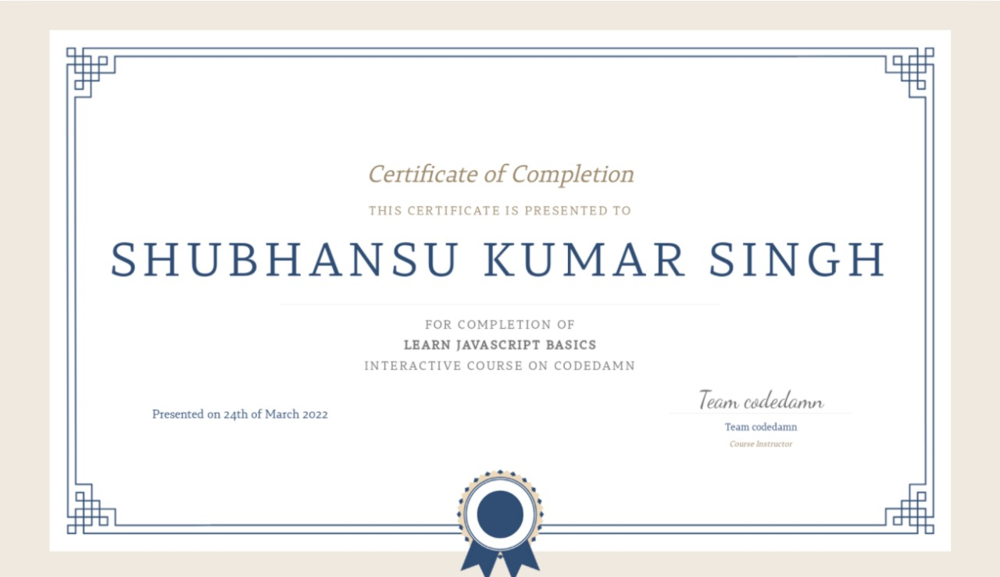

# Learn JavaScript Basics  

I took the [Codedamn's](https://codedamn.com/) [Learn JavaScript Basics](https://codedamn.com/learn/javascript-basics) for learning the basics of JavaScript as a part of full stack learning path.    

I already learnt JavaScript prior to this course from [Complete Javascript course](https://courses.learncodeonline.in/learn/home/Complete-Javascript-course/section/122240/lesson/624566) by [Hitesh Chaudhry](https://www.youtube.com/c/HiteshChoudharydotcom).Hosted on [LearnCodeOnline](https://courses.learncodeonline.in/learn) and [youtube](https://youtube.com/playlist?list=PLRAV69dS1uWSxUIk5o3vQY2-_VKsOpXLD) for free. You can check out the course progress at [JavaScript Tutorial](https://github.com/shubhansu-kr/JavaScript-Tutorial).    
However, I completed this codedamn course as a part of [Full Stack Learning Path](https://codedamn.com/learning-paths/fullstack).    

Check out my codedamn profile for code certification [@shubhansu](https://codedamn.com/user/shubhansu).

Course [Certificate](./JavaScript%20Basics%20-%20Codedamn.pdf) :    
   

Course duration : 16th Feb 2022 - 24th March 2022.    

`This course took more time to complete than usual due sem 2 midterm examination.`